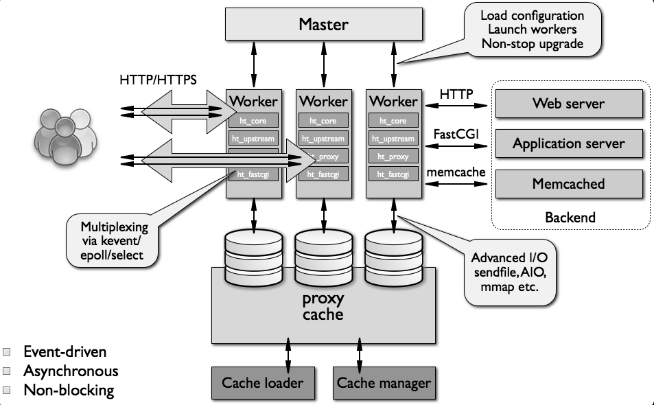
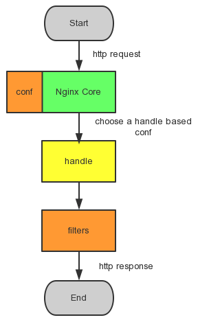

#### 功能描述

Nginx 是一款**轻量级的 Web 服务器**/**反向代理服务器**及电子邮件（IMAP/POP3）代理服务器，在 **BSD-like 协议**下发行。其特点是**占有内存少**，**并发能力强**，事实上 Nginx 的并发能力确实在同类型的网页服务器中表现较好，中国大陆使用 Nginx 网站用户有：百度、京东、新浪、网易、腾讯、淘宝等。

##### 是什么

是一款**高性能**的 **HTTP** 和**反向代理服务器**软件

##### 优势与劣势

Nginx 的优势
**轻量级**：安装文件小，运行时 CPU 内存使用率低；
**性能强**：支持多核，处理静态文件效率高，内核采用的 poll 模型最大可以支持 50K 并发连接；
**支持热部署**：同时启动速度快，可以在不间断服务的情况下对软件和配置进行升级；
**负载均衡**：支持容错和健康检查；
**代理功能强大**：支持无缓存的反向代理，同时支持 IMAP/POP3/SMTP 的代理。
Nginx 的劣势
相比 Apache 模块要少一些，常用模块都有，支持 LUA 语言扩展功能
对动态请求支持不如 Apache
Windows 版本功能有限，受限于 Windows 的特性，支持最好的还是 Unix/Linux 系统

##### Nginx 工作原理

Nginx 由**内核**和**一系列模块**组成：内核提供 **web 服务的基本功能**，如启用网络协议、创建运行环境、接收和分配客户端请求、处理模块之间的交互。模块实现 Nginx 的各种功能和操作。

Nginx 的模块从结构上分为：

**核心模块**： HTTP 模块、EVENT 模块和 MAIL 模块
**基础模块**： HTTP Access 模块、HTTP FastCGI 模块、HTTP Proxy 模块和 HTTP Rewrite 模块
**第三方模块**： HTTP Upstream Request Hash 模块、Notice 模块和 HTTP Access Key 模块及用户自己开发的模块

#### LNMP

**Linux**+**Nginx**+**MySQL**+**PHP**

**Nginx**

```shell
# 启动	start
sudo service nginx start

# 停止	stop
sudo service nginx stop

# 重启	restart
sudo service nginx restart

# 重载配置文件	reload
sudo service nginx reload
```

#### 进程与模块

##### 架构介绍

Nginx 的代码是由一个**核心**和一系列的**模块**组成

**核心**

核心的功能如下：

主要用于提供 WebServer 的基本功能；
实现 Web 和 Mail 反向代理的功能；
还用于启用网络协议；
创建必要的运行时环境以及确保不同的模块之间平滑地进行交互。

**模块**
大多跟协议相关的功能和应用特有的功能都是由 Nginx 的模块实现的

这些功能模块大致可以分为：事件模块、阶段性处理器、输出过滤器、变量处理器、协议、upstream 和负载均衡几个类别，这些功能模块共同组成了 Nginx 的 http 功能。

其中：

事件模块主要用于提供 OS 独立的（不同操作系统的事件机制有所不同）事件通知机制，如 kqueue 或 epoll 等。
协议模块则负责实现 Nginx 通过 HTTP、TLS/SSL、SMTP、POP3 以及 IMAP 与对应的客户端建立会话。

> 在 Nginx 内部，进程间的通信是通过模块的 **pipeline** 或 **chain** 实现的。

##### 进程介绍

Nginx 启动后，系统中会以 **daemon** （守护进程）的方式在后台运行，后台进程包含一个 **master** 进程和多个 **worker** 进程（你可以理解为工人和管理员）

**Nginx 处理连接的过程**
Nginx 不会为每个连接派生进程或线程，而是由 **worker** 进程通过**监听共享套接字接收新请求**，并且使用高效的循环来处理数千个连接。

Nginx 不使用仲裁器或分发器来**分发连接**，这个工作由**操作系统内核机制**完成。

监听套接字在启动时就完成初始化，worker 进程通过这些套接字接收、读取请求和输出响应。

**master 进程**
当 Nginx 在启动后，会有一个 master 进程和多个 worker 进程。

master 进程主要用来**管理 worker** 进程，master 要做的就是：接收来自外界的信号，向各 worker 进程发送信号，监控 worker 进程的运行状态，当 worker 进程退出后（异常情况下），会自动重新启动新的 worker 进程。

master 进程主要完成如下工作：

读取并验证配置信息；
创建、绑定及关闭套接字；
启动、终止 worker 进程及维护 worker 进程的个数；
无须中止服务而重新配置工作；
控制非中断式程序升级，启用新的二进制程序并在需要时回滚至老版本；
重新打开日志文件；
编译嵌入式 Perl 脚本。

**worker 进程**
对于基本的网络事件，Nginx 则是放在 worker 进程中来处理。多个 worker 进程之间是**对等的**，他们同等**竞争来自客户端的请求**，各进**程互相之间是独立**的。

一个请求，只可能在一个 worker 进程中处理，一个 worker 进程，不可能处理其它进程的请求（一对一）。

然而 Nginx 没有专门地仲裁或连接分布的 worker，这项工作是由操作系统内核机制完成的。在启动时，创建一组初始的监听套接字，HTTP 请求和响应之时，worker 连续接收、读取和写入套接字。

worker 进程主要完成如下工作：

接收、传入并处理来自客户端的连接
提供反向代理及过滤功能
nginx 任何能完成的其它任务

**Nginx 的进程模型**



（1）首先，每个 worker 进程都是从 master 进程 fork 过来，在 master 进程里面，先建立好需要 listen 的 socket（listenfd）之后，然后再 fork 出多个 worker 进程。

（2）所有 worker 进程的 listenfd 会在新连接到来时变得可读，为保证只有一个进程处理该连接，所有 worker 进程会在注册 listenfd 读事件前抢 accept_mutex，抢到互斥锁的那个进程注册 listenfd 读事件，然后在读事件里调用 accept 接受该连接。

（3）当一个 worker 进程在 accept 这个连接之后，就开始读取请求、解析请求、处理请求。产生数据后，再返回给客户端，最后才断开连接，这样一个完整的请求就是这样的了。

Nginx 采用多 worker 的方式来处理请求，每个 worker 里面只有一个主线程，那能够处理的并发数很有限啊，多少个 worker 就能处理多少个并发，何来高并发呢？这就是 Nginx 的高明之处，Nginx 采用了 **异步非阻塞** 的方式来处理请求，也就是说，Nginx 是可以同时处理成千上万个请求的。

##### Nginx 模块介绍

Nginx 真正的魅力在于它的模块，整个应用程序建立在一个模块化系统之上，在编译时，可以对每一个模块进行启用或者禁用，需要什么就定制什么

配置文件结构图


Nginx 本身做的工作实际很少，当它接到一个 HTTP 请求时，它仅仅是通过查找配置文件将此次请求映射到一个 location block，而此 location 中所配置的各个指令则会启动不同的模块去完成工作，因此**模块**可以看做 Nginx **真正的劳动工作者**。

通常一个 location 中的指令会涉及一个 handler 模块和多个 filter 模块（当然，多个 location 可以复用同一个模块）。
handler 模块负责处理请求，完成响应内容的生成；
filter 模块对响应内容进行处理。
因此 Nginx 模块开发分为 **handler** 开发和 **filter** 开发

常规请求和响应的过程



##### http index 模块

模块：ngx_http_index_module

语法：index file ...;

eg：

```nginx
location / {
    index index.$geo.html index.html;
}
```

默认值：index index.html

作用域：http,server,location

模块功能及注意：

- 定义将要被作为默认页的文件。
- 文件的名字可以包含变量。
- 文件以配置中指定的顺序被 Nginx 检查。
- 列表中的最后一个元素可以是一个带有绝对路径的文件。

##### http log 模块

模块：ngx_http_log_module

eg:

```nginx
log_format  gzip '$remote_addr-$remote_user[$time_local]' '$request$status $bytes_sent' '"$ http _ referer" "$http_user_agent" "$gzip_ratio"';
access_log  /spool/logs/nginx-access.log  gzip  buffer=32k;
```

**access_log 指令**

语法：

```nginx
access_log path [format [buffer=size]];
# or
access_log off;
```

默认值：access_log	log/access.log combined

作用域：http，server，location

指令功能及注意：

- 指令 access_log 指派路径、格式和缓存大小。
- 参数 off 将清除当前级别的所有 access_log 指令。
- 如果未指定格式，则使用预置的 combined 格式。
- 缓存不能大于能写入磁盘的文件的最大值。在 FreeBSD 3.0-6.0 ，缓存大小无此限制。

**log_format 指令**

语法：

```ngi
log_format name format [format ...];
```

默认值： log_format combined "..."

作用域： http，server

##### Access 模块

模块：ngx_http_access_module

模块功能及注意：

- 此模块提供了一个简易的基于主机的访问控制（对网络地址有放行和禁止的权利），使 Nginx 可以对特定 **IP** 客户端进行控制。
- 规则为：顺序匹配，以第一次匹配到的结果为准

eg：

```nginx
# deny 拒绝
# 仅允许网段 10.1.1.0/16 和 192.168.1.0/24 中除 192.168.1.1 之外的 ip 访问。
location / {
  deny    192.168.1.1;
  allow   192.168.1.0/24;
  allow   10.1.1.0/16;
  deny    all;
}
```

**放行语法**

```nginx
allow address | CIDR | all;
```

> 在上面的配置范例中， 192.168.1.1 为 address，192.168.1.0/24 为 CIDR，all 对应 all。

作用域：http, server, location, limit_except

指令功能：allow描述的网络地址有权直接访问

**禁止语法**

```nginx
deny address | CIDR | all;
```

作用域：`http, server, location, limit_except`

指令功能：`deny` 描述的网络地址拒绝访问

##### Rewrite 模块

模块：ngx_http_rewrite_module

模块功能及注意：

- 执行 `URL` 重定向，允许你去掉带有恶意的 `URL`，包含多个参数（修改）
- 利用正则的匹配，分组和引用，达到目的

eg：

```nginx
if ($http_user_agent ~ MSIE) {
  rewrite  ^(.*)$  /msie/$1  break;
}
if ($http_cookie ~* "id=([^;] +)(?:;|$)" ) {
  set  $id  $1;
}
if ($request_method = POST ) {
  return 405;
}
if (!-f $request_filename) {
  break;
  proxy_pass  http://127.0.0.1;
}
if ($slow) {
  limit_rate  10k;
}
if ($invalid_referer) {
  return   403;
}
```

**if 语句块**

语法：

```nginx
if (condition) {
  ...
}
```

功能描述：对重定向进行流程控制

作用域：server, location

**return 语句**

语法：

```nginx
return code;
```

作用域：server, location, if

功能描述：这个指令根据规则的执行情况，返回一个状态值给客户端。

- 可使用值包括：204，400，402 - 406，408，410，411，413，416 及 500 - 504。
- 也可以发送非标准的 444 代码 - 未发送任何头信息，然后结束连接。

**rewrite 语句**

语法：

```nginx
rewrite regex replacement flag
```

> regex ：用于匹配 url 的正则表达式。使用括号（）标记要截取的内容
>
> replacement : 匹配成功后用于替换 url 中被截取内容的字符串
>
> flag : 用来设置 rewrite 对 url 的处理行为

常用的 flag 如下：

- last : 表示完成 rewrite
- break: 本规则匹配完成后，终止匹配，不再匹配后面的规则
- redirect : 返回 302 临时重定向，地址栏会显示跳转后的地址
- permanent: 返回 301 永久重定向，地址栏会显示跳转后的地址

作用域：server, location, if

功能描述：这个指令根据正则表达式或者待替换的字符串来更改 URL。指令根据配置文件中的先后顺序执行生效。

##### Proxy 模块

功能描述：此模块能代理请求到其它服务器。就是说允许你把客户端的 HTTP 请求转到后端服务器（这部分的指令非常多，但不是全部都会被用到，这里是比较常见的指令简介）。

```nginx
# 强制一些被忽略的头传递到客户端
proxy_pass_header Server;

# 允许改写出现在 HTTP 头却被后端服务器触发重定向的 URL，对响应本身不做任何处理
proxy_redirect off;

# 允许你重新定义代理 header 值再转到后端服务器，目标服务器可以看到客户端的原始主机名
proxy_set_header Host $http_host;

# 目标服务器可以看到客户端的真实 IP，而不是转发服务器的 IP。
proxy_set_header X-Real-IP $remote_addr;
```

##### upstream 模块

模块：`ngx_http_upstream_module`

语法：

```nginx
upstream name {
  ...
}
```

功能简介：该指令使请求被上行信道之间的基于客户端的 IP 地址分布

配置范例：

```nginx
upstream backend  {
  server backend1.example.com weight=5;
  server backend2.example.com:8080;
  server unix:/tmp/backend3;
}

server {
  location / {
    proxy_pass  http://backend;
  }
}
```

**upstream 指令**

语法：

```nginx
upstream name { ... }
```

作用域：http

指令功能及注意：

- 这个指令描述了一个服务器的集合，该集合可被用于 proxy_pass 和 fastcgi_pass 指令中，作为一个单独的实体。
- 这些服务器可以是监听在不同的端口，另外，并发使用同时监听 TCP 端口和 Unix 套接字的服务器是可能的。
- 这些服务器能被分配不同的权重。如果没有指定，则都为 1 。

eg： 

```nginx
upstream backend {
  server backend1.example.com weight=5;
  server 127.0.0.1:8080 max_fails=3  fail_timeout=30s;
  server unix:/tmp/backend3;
}
```

 **ip_hash 指令**

作用域： upstream

```nginx
upstream backend {
  ip_hash;
  server   backend1.example.com;
  server   backend2.example.com;
  server   backend3.example.com;
  server   backend4.example.com;
}
```

指令功能及注意：

- 指定服务器组的**负载均衡方法**，请求基于客户端的 IP 地址在服务器间进行分发。**IPv4 地址的前三个字节**或者 **IPv6 的整个地址**，会被用来作为一个**散列 key**。
- 这种方法可以确保从同一个客户端过来的请求，会被传给同一台服务器。除了当服务器被认为不可用的时候，这些客户端的请求会被传给其他服务器，而且很有可能也是同一台服务器。

> 如果其中一个服务器想暂时移除，应该加上 down 参数。这样可以保留当前客户端 IP 地址散列分布
>
> ```nginx
> upstream backend {
>   ip_hash;
>   server   backend1.example.com;
>   server   backend2.example.com;
>   server   backend3.example.com  down;
>   server   backend4.example.com;
> }
> ```

**server 指令**

语法：

```nginx
server address [parameters];
```

作用域： upstream

指令功能及注意：

- 定义**服务器的地址** address 和其他**参数** parameters。
- 地址可以是**域名**或者 **IP 地址**，端口是可选的，或者是指定“unix:”前缀的 UNIX 域套接字的路径。如果没有指定端口，就使用 80 端口。
- 如果一个域名解析到多个 IP，本质上是定义了多个 server。

实例：

```nginx
upstream  backend  {
  server   backend1.example.com    weight=5;
  server   127.0.0.1:8080          max_fails=3  fail_timeout=30s;
  server   unix:/tmp/backend3;
}
```

#### Nginx优化

**event模块**

```nginx
events {
    # 一个 worker 进程可以同时打开的链接数
	worker_connections 1024;
    # Nginx 在收到新链接的请求通知时，尽可能接受链接
    multi_accept on;
}
```

**http模块**

```nginx
http {
    ##
    # Basic Setting
    ##
    
    # 指向 sendfile()函数。sendfile() 在磁盘和 TCP 端口（或者任意两个文件描述符）之间复制数据
    sendfile on;
    # 一个包中发送全部的头文件，而不是一个一个发送。
    tcp_nopush on;
    # 不要缓存数据，应该快速的发送小数据（这仅仅应该用于频繁发送小的碎片信息而无需立刻获取响应的，需要实时传递数据的应用中）。
    tcp_nodelay on;
    # 与客户端的 keep-alive 链接的超时时间。服务器会在这个时间后关闭链接。可降低这个值，以避免让 worker 过长时间的忙碌。
    keepalive_timeout 65;
    types_hash_max_size 2048;
    # server_tokens off;
    # server_names_hash_bucket_size 64
    # server_name_in_redirect off;
    include /etc/nginx/mime.types;
    default_type application/octet-stream;
    
    ##
    # Logging Setting
    ##
    
    # 确定了 Nginx 是否保存访问日志。将这个设置为关闭可以降低磁盘 IO 而提升速度。
    access_log off;
    # 设置 Nginx 应当记录临界错误
    error_log /var/log/nginx/error.log
    
    ##
    # Gzip settings
    ##
        
    # 设置 nginx gzip 压缩发送的数据。这会减少需要发送的数据的数量
    gzip on;
    # 为指定的客户端禁用 gzip 功能
    gzip_disable "msie6";
    gzip_vary on;
    # 允许或禁止基于请求、响应的压缩。设置为 any，就可以 gzip 所有的请求
    gzip_proxied any;
    # 设置了数据压缩的等级。等级可以是 1-9 的任意一个值，9 表示最慢但是最高比例的压缩。
    gzip_comp_level 9;
    gzip_buffers 16 8k;
    # 设置进行 gzip 的类型
    gzip_types text/plain text/css application/json application/x-javascript text/xml application/xml application/xml+rss text/javascript;
    
	##
    # Virtual Host Configs
    ##

    include /etc/nginx/conf.d/*.conf;
    include /etc/nginx/sites-enabled/*;
        
    
# mail {
#   # See sample authentication script at:
#   # http://wiki.nginx.org/ImapAuthenticateWithApachePhpScript
#
#   # auth_http localhost/auth.php;
#   # pop3_capabilities "TOP" "USER";
#   # imap_capabilities "IMAP4rev1" "UIDPLUS";
#
#   server {
#       listen     localhost:110;
#       protocol   pop3;
#       proxy      on;
#   }
#
#   server {
#       listen     localhost:143;
#       protocol   imap;
#       proxy      on;
#   }
}
```

-awm.conf

```bash
    #WebSocket 反向代理
    map $http_upgrade $connection_upgrade {
        default upgrade;
        '' close;
    }
    #负载均衡
    upstream chakra {
        #ip_hash;
        server 127.0.0.1:5021;
    }
    upstream httpsChakra {
        #ip_hash;
        server 127.0.0.1:15021;
    }
    upstream uais {
        #ip_hash;
        server 127.0.0.1:10038;
    }

    upstream utilities {
        server 127.0.0.1:5151;
    }

    #upstream offlinemap {
            #server 192.168.1.225:8081;
    #}

	#监听的服务器配置
    server{
    	# 监听端口
        listen 8000;
        # 访问域名
        server_name localhost;
        # rewrite实现RUL地址的重定向 ^(.*)$表示匹配所有 匹配成功后跳转到https://$host:8001 permanent是永久301重定向标记
        rewrite ^(.*)$  https://$host:8001 permanent;
        # URL匹配
        location ~ / {
        	# 首页文件
            index index.html index.php index.htm;
        }
    }

    server {
        listen 8001 ssl;
        server_name          localhost;
        ssl_certificate      ssl/private.crt;
        #证书和密钥文件均放在nginx/conf/ssl目录下
        ssl_certificate_key  ssl/private.key;
        ssl_session_cache    shared:SSL:10m;
        #设置存储session参数的缓存的类型和大小
        ssl_session_timeout  5m;
        #指定客户端可以重用会话参数的时间
        ssl_protocols        TLSv1 TLSv1.1 TLSv1.2;
        # 开启gzip组件
        gzip on;
        gzip_static on;
        #缓冲(压缩在内存中缓冲几块? 每块多大?)
        gzip_min_length 1k;
        gzip_buffers 4 32k;
        gzip_http_version 1.1;
        #推荐6 压缩级别(级别越高,压的越小,越浪费CPU计算资源)
        gzip_comp_level 5;
        gzip_proxied off;
        gzip_types text/plain application/x-javascript text/css application/xml;
        gzip_vary on;
        #配置禁用gzip条件，支持正则。此处表示ie6及以下不启用gzip（因为ie低版本不支持）
        gzip_disable "MSIE [1-6].";
        add_header Access-Control-Allow-Origin *;
        add_header Access-Control-Allow-Methods 'GET, POST, OPTIONS';
        add_header Access-Control-Allow-Headers 'DNT,X-Mx-ReqToken,Keep-Alive,User-Agent,X-Requested-With,If-Modified-Since,Cache-Control,Content-Type,Authorization';       
        # 匹配任何查询
        location / {
            charset utf-8;
            # windows 注意目录反斜杠和下面location ~ 改成相同路径
            root   /home/public/nginx/nginx-1.14.0/html/awm/dist;
            index  index.html;
            add_header Access-Control-Allow-Origin *;
            add_header Access-Control-Allow-Methods 'GET, POST, OPTIONS';
            add_header Access-Control-Allow-Headers 'DNT,X-Mx-ReqToken,Keep-Alive,User-Agent,X-Requested-With,If-Modified-Since,Cache-Control,Content-Type,Authorization';
            if ($request_method = 'OPTIONS') {
                return 204;
            }
        }
		# 匹配以...结尾
        location ~ .*\.(js|css|gif|jpg|jpeg|png|bmp|swf|flv|html|htm|ico)$ {
            root   /home/public/nginx/nginx-1.14.0/html/awm/dist;
            expires 10d;
        }
		# 匹配以/api/ 开头
        location  ^~ /api/ {
            proxy_pass http://chakra;
        }

        location  ^~ /httpsApi/ {
            proxy_read_timeout 300s;
            proxy_send_timeout 300s;
            client_max_body_size 1000m;
            proxy_pass https://httpsChakra/api/;
        }

        location  ^~ /cloud/uais {
            proxy_pass http://uais;
        }
        #离线地图
        #location /tiles/ {
            #proxy_pass http://offlinemap;
        #}
        location ^~ /vodio/ {
            root /dist/vodio/;
        }

        location ^~ /chrome {
            proxy_pass http://utilities;
        }

        location  ^~ /api/utilities/ {
            proxy_pass http://utilities;
        }

        location ^~ /common/websocket/ {
        	#代理设置
            proxy_pass http://chakra;
            #连接成功后，后端服务器响应时间(代理接收超时)
            proxy_read_timeout 300s;
            #后端服务器数据回传时间(代理发送超时)
            proxy_send_timeout 300s;
            proxy_set_header Host $host;
            proxy_set_header X-Real-IP $remote_addr;
            proxy_set_header X-Forwarded-For $proxy_add_x_forwarded_for;
            proxy_http_version 1.1;
            proxy_set_header Upgrade $http_upgrade;
            proxy_set_header Connection $connection_upgrade;
        }

        location ^~ /static/ {
            root /opt/project/ncp/ncp-surface;
         # 对于 static/，使用强缓存，通过 Cache-Control 的 max-age 或者 Expires 判断，命中则返回 200
            expires 30d;
        }

        #error_page  404              /404.html;
        # redirect server error pages to the static page /50x.html
        #
        error_page   500 502 503 504  /50x.html;
        location = /50x.html {
            root   html;
        }
    }
```

nginx.conf

```nginx
#user  www www;
worker_processes  auto;

error_log  logs/error.log crit;
pid        logs/nginx.pid;

#Specifies the value for maximum file descriptors that can be opened by this process. 
worker_rlimit_nofile 1024;

events 
{
  #use epoll;
  worker_connections 1024;
}


http {
    include       mime.types;
    default_type  application/octet-stream;

    #charset  gb2312;

    server_names_hash_bucket_size 128;
    client_header_buffer_size 32k;
    large_client_header_buffers 4 32k;
    client_max_body_size 8m;

    sendfile on;
    tcp_nopush     on;

    keepalive_timeout 15;

    tcp_nodelay on;

    #后端返回了shiro的readme比较大，这里需要配置，否则会出现502错误
    proxy_buffer_size   128k;
    proxy_buffers   4 256k;
    proxy_busy_buffers_size   256k;
    proxy_redirect off;
    proxy_set_header  Host  $host;
    proxy_set_header  X-Real-IP  $remote_addr;  
    proxy_set_header  X-Forwarded-For  $proxy_add_x_forwarded_for;

    fastcgi_connect_timeout 300;
    fastcgi_send_timeout 300;
    fastcgi_read_timeout 300;
    fastcgi_buffer_size 128k;
    fastcgi_buffers 32 32k;
    fastcgi_busy_buffers_size 128k;
    fastcgi_temp_file_write_size 128k;

    gzip on;
    gzip_min_length  1k;
    gzip_buffers     4 16k;
    gzip_http_version 1.0;
    gzip_comp_level 2;
    gzip_types       text/plain application/x-javascript text/css application/xml;
    gzip_vary on;
    gzip_disable msie6;
    #limit_zone  crawler  $binary_remote_addr  10m;
    log_format '$remote_addr - $remote_user [$time_local] "$request" '
                  '$status $body_bytes_sent "$http_referer" '
                  '"$http_user_agent" "$http_x_forwarded_for"';
    include servers/*.conf;
}
```

