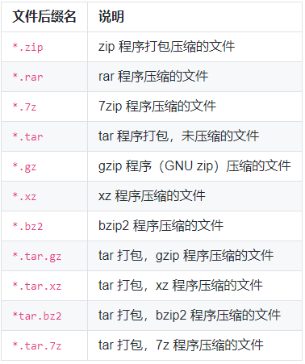

#### 基本概念及操作

##### 重要快捷键

**Tab**	命令补全

**Ctrl+c**	强行终止当前程序

Ctrl+d	键盘输入结束或退出终端
Ctrl+s	暂停当前程序，暂停后按下任意键恢复运行
Ctrl+z	将当前程序放到后台运行，恢复到前台为命令fg
**Ctrl+a**	将光标移至输入行头，相当于Home键
**Ctrl+e**	将光标移至输入行末，相当于End键
**Ctrl+k**	删除从光标所在位置到行末

##### 通配符

**touch**命令有两个功能：一是用于把已存在文件的时间标签更新为系统当前的时间（默认方式），数据保留下来；二是用来创建新的空文件。

```shell
touch adaf.txt dsfnks.txt
# 一次性创建多个文件
touch ll{1..10}_study.txt

* 匹配 0 或多个字符
?	匹配任意一个字符
[list]	匹配 list 中的任意单一字符
[^list] 匹配 除 list 中的任意单一字符以外的字符
[c1-c2]	匹配 c1-c2 中的任意单一字符 如：[0-9] [a-z]
{string1,string2,...}	匹配 string1 或 string2 (或更多)其一字符串
{c1..c2}	匹配 c1-c2 中全部字符 如{1..10}
```

#### 用户

##### 查看用户

```shell
who am i
shiyanlou pts/1        2021-01-27 14:30 (192.168.40.2)
whoami
shiyanlou
```

##### 创建用户

**root** 账户拥有整个系统至高无上的权限，比如新建和添加用户。

```shell
# 创建用户
sudo adduser lilei

# 切换用户
su -l lilei
```

退出当前用户，可以使用 **exit** 命令或者使用快捷键 **Ctrl+D**

##### 删除用户

```shell
sudo deluser lilei --remove-home
```

##### 变更文件所属者

```shell
# chown
sudo chown shiyanlou lltest
```

##### 修改文件权限


我们刚刚新建的文件 lltest的权限是 **rw-rw-rw-**，换成对应的十进制表示就是 666，这就表示这个文件的拥有者，所属用户组和其他用户具有读写权限，不具有执行权限。

权限改为只有我自己可以用那么就可以用这个方法更改它的权限。

```shell
# chmod 
chmod 600 lltest
```


#### 文件

**ls**

**ls -l** 长格式

**ls -a** 显示除了 `.`（当前目录）和 `..`（上一级目录）之外的所有文件，包括隐藏文件（Linux 下以 `.` 开头的文件为隐藏文件）

##### 目录


**cd** 切换目录  **.**当前目录	**..**上级目录

```shell
cd ..	进入上级目录
cd ~	进入home目录
pwd		当前路径
```

##### 新建目录

```shell
mkdir mydir
mkdir -p father/son/grandson
```

##### 复制

```shell
# 复制文件
cp # 命令（copy）复制一个文件到指定目录
cp test /father/son/grandson
# 复制目录  -r -R 递归复制
cp -r father family
cp -R father family
```

##### 删除

```shell
# 删除文件
rm test
rm -f test		# -f 强制删除
# 删除目录
rm -r father
rm -R son 
rm -rf grandson
```

##### 移动

```shell
touch test
mkdir son
mkdir testdir
mv test testdir
mv son testdir
```

##### 重命名文件

```shell
touch test 
mv test test2
# 批量重命名 rename


```

##### 查看文件

```shell
# 正序显示  -n 显示行号
cat -n passwd  
# 倒序显示
tac passwd
# 添加行号并打印，比 cat -n 更专业的行号打印命令
nl passwd
# more less 分页查看文件
more passwd    # enter 滚动一行 space 滚动一屏  h 帮助   q 退出
# head tail 查看文件头几行，尾几行（默认10行）
tail -n 1 passwd   # 只看一行
tail -n 5 -f passwd # -f 动态查看内容
```

##### 编辑文件

```shell
# vim 
:q!		退出 不保存内容
:wq		保存文件并退出
x		删除字符
i		插入文本
A		添加文本
dw		删除单词的起始处
d$		从当前光标删除到行末
dd		删除整行
u		撤销最后的命令
/ + 字符串		当前文件查找
```

#### 环境变量

```shell
# 变量名只能是英文字母、数字或者下划线，且不能以数字作为开头
tmp=l
# echo 字符串输出  $ 引用一个变量的值
echo $tmp
```

**set**				显示当前 Shell 所有变量，包括其内建环境变量（与 Shell 外观等相关），用户自定义变量及导出的环境变量。
**env**				显示与当前用户相关的环境变量，还可以让命令在指定环境中运行。
**export**			显示从 Shell 中导出成环境变量的变量，也能通过它将自定义变量导出为环境变量。

永久的：需要修改配置文件，变量永久生效；

临时的：使用 export 命令行声明即可，变量在关闭 shell 时失效。

这里介绍两个重要文件 `/etc/bashrc`（有的 Linux 没有这个文件） 和 `/etc/profile` ，它们分别存放的是 shell 变量和环境变量。

还有要注意区别的是每个用户目录下的一个隐藏文件： .profile 只对当前用户永久生效。因为它保存在当前用户的 Home 目录下，当切换用户时，工作目录可能一并被切换到对应的目录中，这个文件就无法生效。而写在 `/etc/profile` 里面的是对所有用户永久生效，所以如果想要添加一个永久生效的环境变量，只需要打开 `/etc/profile`，在最后加上你想添加的环境变量就好啦。

简单shell脚本

```shell
#!/bin/bash

for ((i=0; i<10; i++ ));do
	"hello shell"
done
```

**source** 环境变量立即生效

##### 搜索文件

命令前面加上 **sudo**  只是普通用户，对 `/etc` 目录下的很多文件都没有访问的权限

```shell
# whereis 简单快捷	没有从硬盘中依次查找，而是直接从数据库中查询。whereis 只能搜索二进制文件（-b)，man 帮助文件（-m）和源代码文件（-s）
whereis find 

# locate 快而全	也不会遍历硬盘，它通过查询 /var/lib/mlocate/mlocate.db 数据库来检索信息。定时任务每天自动执行 updatedb 命令来更新数据库。刚添加的文件，可能会找不到，需要手动执行一次 updatedb 命令
locate /usr/share/*.jpg

# which 小而精 确定是否安装了某个指定的程序，因为它只从 PATH 环境变量指定的路径中去搜索命令并且返回第一个搜索到的结果。
which nginx

# find 精而细	命令的路径是作为第一个参数的， 基本命令格式为 find [path][option] [action]
sudo find /etc/ -name interfaces	# sudo 只是普通用户，对 /etc 目录下的很多文件都没有访问的权限
```

#### 文件打包和解压缩




##### zip压缩打包

```shell
# zip	-r 递归打包包含子目录的全部内容  -q 安静模式，即不向屏幕输出信息  -o 表示输出文件，需在其后紧跟打包输出文件名
zip -r -q -o test.zip /home/shiyanlou/Desktop

# -[1-9]，1 表示最快压缩但体积大，9 表示体积最小但耗时最久 -x 是为了排除我们上一次创建的 zip 文件，否则又会被打包进这一次的压缩文件中
zip -r -9 -q -o test.zip /home/shiyanlou/Desktop -x ~/*.zip

# -e 加密解压
zip -r -e -o shiyanlou_encryption.zip /home/shiyanlou/Desktop

```

##### 解压缩zip文件

```shell
# unzip		-q 安静模式	-d 解压到指定目录
unzip -q shiyanlou.zip -d ziptest
```

##### tar打包

```shell
# tar -P 保留绝对路径符  -c 创建一个tar包文件  -f 指定创建的文件名，注意文件名必须紧跟在 -f 参数之后
tar -P -cf test.tar /home/test

mkdir testdir
# -x 解包一个文件  -C 已存在目录
tar -xf test.tar -C testdir

# 创建*.tar.gz文件   -z 使用 gzip 来压缩文件
tar -czf text.tar.gz /home/test
# 解压*.tar.gz文件
tar -xzf text.tar.gz
```

#### 磁盘管理

```shell
df 		# 磁盘块大小的方式显示容量
df -h 	# 以M，G显示容量
```

#### 任务计划crontab

```shell
# 启动rsyslog
sudo service rsyslog start

# 启动crontab
sudo cron -f &

# 添加计划任务
crontab -e

# 查看添加哪些任务
crontab -l

# cron进程是否启动
ps aux | grep cron
pgrep cron

# 查看命令的日志反馈
sudo tail -f /var/log/syslog

# 删除任务
crontab -r
```

#### 命令执行顺序控制与管道

管道是一种通信机制，通常用于进程间的通信（也可通过 socket 进行网络通信），它表现出来的形式就是将前面每一个进程的输出（stdout）直接作为下一个进程的输入（stdin）。

```shell
# 查看 /etc 目录下有哪些文件和目录
ls -al /etc
# 使用管道将前一个命令(ls)的输出作为下一个命令(less)的输入，然后就可以一行一行地看
ls -al /etc | less

# cut 打印每一行某一字段
# 前五个（包含第五个）
cut /etc/passwd -c -5
# 前五个之后的（包含第五个）
cut /etc/passwd -c 5-
# 第五个
cut /etc/passwd -c 5
# 2 到 5 之间的（包含第五个）
cut /etc/passwd -c 2-5

# grep 文本中或 stdin 中查找匹配字符串
# 一般形式 grep [命令选项]... 用于匹配的表达式 [文件]...
# 搜索/home/shiyanlou目录下所有包含"shiyanlou"的文本文件，并显示出现在文本中的行号： -r 递归搜索子目录中的文件  -n 行号  -I 忽略二进制文件
grep -rnI "shiyanlou" ~

# wc 命令用于统计并输出一个文件中行、单词和字节的数目
# 统计 /etc 下面所有目录数：
ls -dl /etc/*/ | wc -l

# sort 排序

# uniq 去重
```

#### 文本处理

**tr**

```shell
# 删除 "hello shiyanlou" 中所有的'o'，'l'，'h'
$ echo 'hello shiyanlou' | tr -d 'olh'
# 将"hello" 中的ll，去重为一个l
$ echo 'hello' | tr -s 'l'
# 将输入文本，全部转换为大写或小写输出
$ echo 'input some text here' | tr '[:lower:]' '[:upper:]'
```

##### 正则表达式

**基本语法**

选择 

​	**|** 竖直分隔符表示选择，例如 boy|girl 可以匹配 boy 或者 girl。

数量限定

​	***** 星号代表前面的字符可以不出现，也可以出现一次或者多次（0 次、或 1 次、或多次），例如，`0*42` 可以匹配 42、042、0042、00042 等。

​	+表示前面的字符必须出现至少一次(1 次或多次)，例如 `goo+gle` 可以匹配 `gooogle`，`goooogle` 等；

​	? 表示前面的字符**最多出现一次**（0 次或 1 次），例如，`colou?r`，可以匹配 `color` 或者 `colour`;

范围和优先级

**()** 圆括号可以用来定义模式字符串的范围和优先级，这可以简单的理解为是否将括号内的模式串作为一个整体

语法

| `\`         | **将下一个字符标记为一个特殊字符、或一个原义字符。** 例如 `n` 匹配字符 `n`。`\n` 匹配一个换行符。序列 `\\` 匹配 `\` 而 `\(` 则匹配 `(`。 |
| ----------- | ------------------------------------------------------------ |
| `^`         | **匹配输入字符串的开始位置。**                               |
| `$`         | **匹配输入字符串的结束位置。**                               |
| `{n}`       | n 是一个非负整数。**匹配确定的 n 次**。例如 `o{2}` 不能匹配 `Bob` 中的 `o`，但是能匹配 `food` 中的两个 `o`。 |
| `{n,}`      | n 是一个非负整数。**至少匹配 n 次**。例如 `o{2,}` 不能匹配 `Bob` 中的 `o`，但能匹配 `foooood` 中的所有 `o`。`o{1,}` 等价于 `o+`。`o{0,}` 则等价于 `o*`。 |
| `{n,m}`     | m 和 n 均为非负整数，其中 `n<=m`。**最少匹配 n 次且最多匹配 m 次**。例如，`o{1,3}` 将匹配 `fooooood` 中的前三个 `o`。`o{0,1}` 等价于 `o?`。请注意在逗号和两个数之间不能有空格。 |
| `*`         | **匹配前面的子表达式零次或多次**。例如，`zo*` 能匹配 `z`、`zo` 以及 `zoo`。`*` 等价于 `{0,}`。 |
| `+`         | **匹配前面的子表达式一次或多次**。例如，`zo+` 能匹配 `zo` 以及 `zoo`，但不能匹配 `z`。`+` 等价于 `{1,}`。 |
| `?`         | **匹配前面的子表达式零次或一次**。例如，`do(es)?` 可以匹配 `do` 或 `does` 中的 `do`。`?` 等价于 `{0,1}`。 |
| `?`         | 当该字符紧跟在任何一个其他限制符（`*`，`+`，`?`，`{n}`，`{n,}`，`{n,m}`）后面时，匹配模式是非贪婪的。非贪婪模式尽可能少的匹配所搜索的字符串，而默认的贪婪模式则尽可能多的匹配所搜索的字符串。例如，对于字符串 `oooo`，`o+?` 将匹配单个 `o`，而 `o+` 将匹配所有 `o`。 |
| `.`         | **匹配除 `\n` 之外的任何单个字符**。要匹配包括 `\n` 在内的任何字符，请使用类似 `(.｜\n)` 的模式。 |
| `(pattern)` | **匹配 pattern 并获取这一匹配的子字符串**。该子字符串用于向后引用。要匹配圆括号字符，请使用 `\(` 和 `\)`。 |
| x ｜ y      | **匹配 x 或 y**。例如，“z ｜ food”能匹配 `z` 或 `food`。“(z ｜ f)ood”则匹配 `zood` 或 `food`。 |
| `[xyz]`     | 字符集合（character class）。**匹配所包含的任意一个字符**。例如，`[abc]` 可以匹配 `plain` 中的 `a`。其中特殊字符仅有反斜线 `\` 保持特殊含义，用于转义字符。其它特殊字符如星号、加号、各种括号等均作为普通字符。脱字符^如果出现在首位则表示负值字符集合；如果出现在字符串中间就仅作为普通字符。**连字符 `-` 如果出现在字符串中间表示字符范围描述；如果出现在首位则仅作为普通字符。** |
| `[^xyz]`    | 排除型（negate）字符集合。**匹配未列出的任意字符。**例如，`[^abc]` 可以匹配 `plain` 中的 `plin`。 |
| `[a-z]`     | 字符范围。**匹配指定范围内的任意字符。**例如，`[a-z]` 可以匹配 `a` 到 `z` 范围内的任意小写字母字符。 |
| `[^a-z]`    | 排除型的字符范围。**匹配任何不在指定范围内的任意字符**。例如，`[^a-z]` 可以匹配任何不在 `a` 到 `z` 范围内的任意字符。 |

##### grep 模式匹配命令

1. 基本操作

   | `-b`           | 将二进制文件作为文本来进行匹配                               |
   | -------------- | ------------------------------------------------------------ |
   | `-c`           | 统计以模式匹配的数目                                         |
   | `-i`           | 忽略大小写                                                   |
   | `-n`           | 显示匹配文本所在行的行号                                     |
   | `-v`           | 反选，输出不匹配行的内容                                     |
   | `-r`           | 递归匹配查找                                                 |
   | `-A n`         | n 为正整数，表示 after 的意思，除了列出匹配行之外，还列出后面的 n 行 |
   | `-B n`         | n 为正整数，表示 before 的意思，除了列出匹配行之外，还列出前面的 n 行 |
   | `--color=auto` | 将输出中的匹配项设置为自动颜色显示                           |

##### sed 用于过滤和转换文本的流编辑器

1. 常用参数

   ```shell
   sed [参数]... [执行命令] [输入文件]...
   # 形如：
   $ sed -i 's/sad/happy/' test # 表示将test文件中的"sad"替换为"happy"
   # [n1][,n2]command
   # [n1][~step]command
   # n1,n2 表示输入内容的行号，它们之间为 , 逗号则表示从 n1 到 n2 行，如果为 ~ 波浪号则表示从 n1 开始以 step 为步进的所有行；command 为执行动作
   cp /etc/passwd ~
   # 打印2-5行
   nl passwd | sed -n '2,5p'
   # 打印奇数行
   nl passwd | sed -n '1~2p'
   
   # 将输入文本中"shiyanlou" 全局替换为"hehe"，并只打印替换的那一行，注意这里不能省略最后的"p"命令  -g 全局范围
   sed -n 's/shiyanlou/hehe/gp' passwd
   
   nl passwd | grep "shiyanlou"
   # 删除第30行
   sed -i '30d' passwd
   # 查看第30行
   nl passwd | sed -n '30p'
   
   
   ```

   | 参数          | 说明                                                         |
   | ------------- | ------------------------------------------------------------ |
   | `-n`          | 安静模式，只打印受影响的行，默认打印输入数据的全部内容       |
   | `-e`          | 用于在脚本中添加多个执行命令一次执行，在命令行中执行多个命令通常不需要加该参数 |
   | `-f filename` | 指定执行 filename 文件中的命令                               |
   | `-r`          | 使用扩展正则表达式，默认为标准正则表达式                     |
   | `-i`          | 将直接修改输入文件内容，而不是打印到标准输出设备             |

   | 命令 | 说明                                 |
   | ---- | ------------------------------------ |
   | `s`  | 行内替换                             |
   | `c`  | 整行替换                             |
   | `a`  | 插入到指定行的后面                   |
   | `i`  | 插入到指定行的前面                   |
   | `p`  | 打印指定行，通常与 `-n` 参数配合使用 |
   | `d`  | 删除指定行                           |

##### awk文本处理

awk 所有的操作都是基于 **pattern(模式)—action(动作)**对来完成的

```shell
pattern {action}

# 基本命令格式
awk [-F fs] [-v var=value] [-f prog-file | 'program text'] [file...]

# -F 参数用于预先指定前面提到的字段分隔符（还有其他指定字段的方式），-v 用于预先为 awk 程序指定变量，-f 参数用于指定 awk 命令要执行的程序文件，或者在不加 -f 参数的情况下直接将程序语句放在这里，最后为 awk 需要处理的文本输入，且可以同时输入多个文本文件
```

```shell
awk '{print}' test

#

# NR 表示当前读入的记录数，你可以简单的理解为当前处理的行数;OFS 表示输出时的字段分隔符;$N 其中N为相应的字段号，它表示引用相应的字段
# 将 test 的第一行的每个字段单独显示为一行
awk '{if(NR==1){OFS="\n" print $1,$2, $3}else{print}}' test 	# ???问题
awk '{if(NR==1){print $1 "\n" $2 "\n" $3} else{print}}' test 	

# test 的第二行的以点为分段的字段换成以空格为分隔
awk -F'.''{if(NR==2){print $1 "\t" $2 "\t" $3}}' test
awk 'BEGIN{FS="." OFS="\t"}{if(NR==2){print $1,$2,$3}}' test   # ???问题
```

| 变量名     | 说明                                                         |
| ---------- | ------------------------------------------------------------ |
| `FILENAME` | 当前输入文件名，若有多个文件，则只表示第一个。如果输入是来自标准输入，则为空字符串 |
| `$0`       | 当前记录的内容                                               |
| `$N`       | N 表示字段号，最大值为`NF`变量的值                           |
| `FS`       | 字段分隔符，由正则表达式表示，默认为空格                     |
| `RS`       | 输入记录分隔符，默认为 `\n`，即一行为一个记录                |
| `NF`       | 当前记录字段数                                               |
| `NR`       | 已经读入的记录数                                             |
| `FNR`      | 当前输入文件的记录数，请注意它与 NR 的区别                   |
| `OFS`      | 输出字段分隔符，默认为空格                                   |
| `ORS`      | 输出记录分隔符，默认为 `\n`                                  |

#### 进程查看

##### top

 top 是一个前台程序，所以是一个可以交互的：

| 常用交互命令 | 解释                                                         |
| ------------ | ------------------------------------------------------------ |
| q            | 退出程序                                                     |
| I            | 切换显示平均负载和启动时间的信息                             |
| P            | 根据 CPU 使用百分比大小进行排序                              |
| M            | 根据驻留内存大小进行排序                                     |
| i            | 忽略闲置和僵死的进程，这是一个开关式命令                     |
| k            | 终止一个进程，系统提示输入 PID 及发送的信号值。一般终止进程用 15 信号，不能正常结束则使用 9 信号。安全模式下该命令被屏蔽。 |

```shell
top 
```


**top第一行数据**

| 内容                         | 解释                                    |
| ---------------------------- | --------------------------------------- |
| top                          | 表示当前程序的名称                      |
| 14:23:04                     | 表示当前的系统的时间                    |
| up 431days,10:09             | 表示该机器已经启动了多长时间            |
| 1 user                       | 表示当前系统中只有一个用户              |
| load average: 0.09,0.06,0.06 | 分别对应 1、5、15 分钟内 cpu 的平均负载 |

load average：CPU 工作量的度量，具体来说也就是指运行队列的平均长度，也就是等待 CPU 的平均进程数相关的一个计算值。

eg：单 CPU、单内核的，把它比喻成是一条单向的桥，把 CPU 任务比作汽车。

​		load = 0 的时候意味着这个桥上并没有车，cpu 没有任何任务；
​		load < 1 的时候意味着桥上的车并不多，一切都还是很流畅的，cpu 的任务并不多，资源还很充足；
​		load = 1 的时候就意味着桥已经被车给占满了，没有一点空隙，cpu 已经在全力工作了，所有的资源都被用完了，当然还好，这还在能力范围之内，只是有点慢而已；
​		load > 1 的时候就意味着不仅仅是桥上已经被车占满了，就连桥外都被占满了，cpu 已经在全力工作，系统资源的用完了，但是还是有大量的进程在请求，在等待。若是这个值大于 2 表示进程请求超过 CPU 工作能力的 2 倍。而若是这个值大于 5 说明系统已经在超负荷运作。

```shell
# 查看物理 CPU 的个数
cat /proc/cpuinfo | grep "physical id" | sort | uniq |wc -l

# 每个 cpu 的核心数
cat /proc/cpuinfo | grep "physical id" | grep "0" | wc -l
```

**top第二行数据**

| 内容            | 解释                 |
| --------------- | -------------------- |
| Tasks: 25 total | 进程总数             |
| 1 running       | 1 个正在运行的进程数 |
| 24 sleeping     | 24 个睡眠的进程数    |
| 0 stopped       | 没有停止的进程数     |
| 0 zombie        | 没有僵尸进程数       |

**top第三行数据**

| 内容             | 解释                                                         |
| ---------------- | ------------------------------------------------------------ |
| `Cpu(s): 1.8%us` | 用户空间进程占用 CPU 百分比                                  |
| `0.5% sy`        | 内核空间运行占用 CPU 百分比                                  |
| `0.0%ni`         | 用户进程空间内改变过优先级的进程占用 CPU 百分比              |
| `97.5%id`        | 空闲 CPU 百分比                                              |
| `0.0%wa`         | 等待输入输出的 CPU 时间百分比                                |
| `0.0%hi`         | 硬中断(Hardware IRQ)占用 CPU 的百分比                        |
| `0.2%si`         | 软中断(Software IRQ)占用 CPU 的百分比                        |
| `0.0%st`         | (Steal time) 是 hypervisor 等虚拟服务中，虚拟 CPU 等待实际 CPU 的时间的百分比 |

CPU 利用率是对一个时间段内 CPU 使用状况的统计，通过这个指标可以看出在某一个时间段内 CPU 被占用的情况；而 Load Average 是 CPU 的 Load，是在一段时间内 CPU 正在处理以及等待 CPU 处理的进程数情况统计信息

**top第四行数据**

| 内容           | 解释                 |
| -------------- | -------------------- |
| 8176740 total  | 物理内存总量         |
| 8032104 used   | 使用的物理内存总量   |
| 144636 free    | 空闲内存总量         |
| 313088 buffers | 用作内核缓存的内存量 |

系统中可用的物理内存最大值并不是 free 这个单一的值，而是 **free + buffers + swap 中的 cached 的和**。

**top第五行数据**

| 内容   | 解释                                                         |
| ------ | ------------------------------------------------------------ |
| total  | 交换区总量                                                   |
| used   | 使用的交换区总量                                             |
| free   | 空闲交换区总量                                               |
| cached | 缓冲的交换区总量，内存中的内容被换出到交换区，而后又被换入到内存，但使用过的交换区尚未被覆盖 |

**进程情况**

| 列名    | 解释                                         |
| ------- | -------------------------------------------- |
| PID     | 进程 id                                      |
| USER    | 该进程的所属用户                             |
| PR      | 该进程执行的优先级 priority 值               |
| NI      | 该进程的 nice 值                             |
| VIRT    | 该进程任务所使用的虚拟内存的总数             |
| RES     | 该进程所使用的物理内存数，也称之为驻留内存数 |
| SHR     | 该进程共享内存的大小                         |
| S       | 该进程进程的状态: S=sleep R=running Z=zombie |
| %CPU    | 该进程 CPU 的利用率                          |
| %MEM    | 该进程内存的利用率                           |
| TIME+   | 该进程活跃的总时间                           |
| COMMAND | 该进程运行的名字                             |

**NICE 值叫做静态优先级**，是**用户空间**的一个优先级值，其取值范围是 -20 至 19。这个值越小，表示进程”优先级”越高，而值越大“优先级”越低。

**PR 值表示 Priority 值叫动态优先级**，是进程在**内核中实际**的优先级值，进程优先级的取值范围是通过一个宏定义的，这个宏的名称是 **MAX_PRIO**，它的值为 140。Linux 实际上实现了 140 个优先级范围，取值范围是从 0-139，这个值越小，优先级越高。而这其中的 0-99 是实时进程的值，而 100-139 是给用户的。

其中 PR 中的 100 to 139 值部分有这么一个对应 PR = 20 + (-20 to +19)，这里的 -20 to +19 便是 nice 值，所以说两个虽然都是优先级，而且有千丝万缕的关系，但是他们的值，他们的作用范围并不相同。

**VIRT 任务所使用的虚拟内存的总数**，其中包含所有的代码，数据，共享库和被换出 swap 空间的页面等所占据空间的总数。

##### ps

```shell
ps aux
ps aux | grep aa
```

##### pstree

##### kill

```shell
kill -9 PID
```


