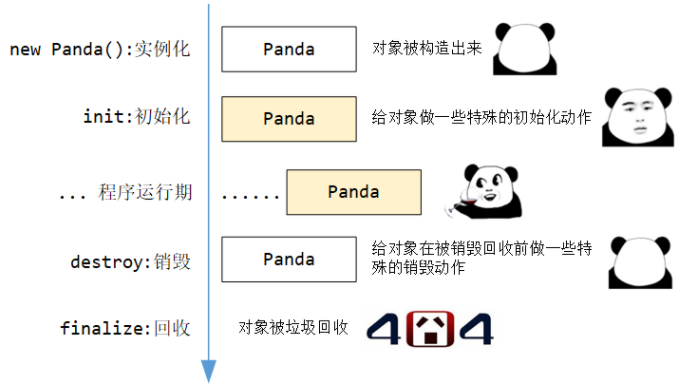

### 1. 生命周期的意义

#### 1.1 生命周期的阶段

一个对象从被创建，到被垃圾回收，可以宏观的划分为 5 个阶段：

- **创建 / 实例化阶段**：此时会调用类的构造方法，产生一个新的对象
- **初始化阶段**：此时对象已经创建好，但还没有被正式使用，可能这里面需要做一些额外的操作（如预初始化数据库的连接池）
- **运行使用期**：此时对象已经完全初始化好，程序正常运行，对象被使用
- **销毁阶段**：此时对象准备被销毁，已不再使用，需要预先的把自身占用的资源等处理好（如关闭、释放数据库连接）
- **回收阶段**：此时对象已经完全没有被引用了，被垃圾回收器回收

#### 1.2 SpringFramework能干预的生命周期阶段

 **Servlet** 分别叫 `init` 和 `destroy` ，这两个方法都是**被 Web 容器（ Tomcat 等）调用的吧，用来初始化和销毁 Servlet 的**。这种方法的设计思想其实就是 “**回调机制**” ，它**都不是自己设计的，而是由父类 / 接口定义好的，由第三者（框架、容器等）来调用**。回调机制跟前面咱学的那些 `Aware` 接口的回调注入，在核心思想上其实是一样的。

理解了生命周期的阶段，以及回调的机制，下面咱就可以来学习 SpringFramework 中提供的初始化和销毁的回调开口了。

> 生命周期的触发，更适合叫回调，因为生命周期方法是咱定义的，但方法被调用，是框架内部帮我们调的，那也就可以称之为 “回调” 了。