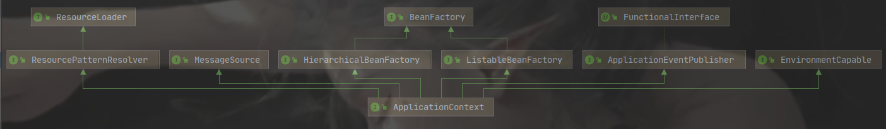

#### 依赖查找的多种姿势

试想，如果一个接口有多个实现，而咱又想一次性把这些都拿出来，那 `getBean` 方法显然就不够用了，需要使用额外的方式。

```xml
<?xml version="1.0" encoding="UTF-8"?>
<beans xmlns="http://www.springframework.org/schema/beans"
       xmlns:xsi="http://www.w3.org/2001/XMLSchema-instance"
       xsi:schemaLocation="http://www.springframework.org/schema/beans http://www.springframework.org/schema/beans/spring-beans.xsd">

    <bean id="demoMySQLDao" class="basic_dl.oftype.dao.impl.DemoMySQLDao"></bean>
    <bean id="demoOracleDao" class="basic_dl.oftype.dao.impl.DemoOracleDao"></bean>
</beans>
```

```java
public static void main(String[] args) throws Exception{
    // 读取配置文件 获取单个bean
    // BeanFactory factory = new ClassPathXmlApplicationContext("basic_dl/quickstart_byname.xml");
    // factory.getBean
    ApplicationContext ctx = new ClassPathXmlApplicationContext("basic_dl/quickstart_oftype.xml");
    Map<String, DemoDao> beans = ctx.getBeansOfType(DemoDao.class);
    beans.forEach((beanName,bean) -> {
        System.out.println(beanName + " : " + bean);
    });
}
```

#### BeanFactory与ApplicationContext

**ApplicationContext** 也是一个接口，而且它是 **BeanFactory** 的子接口

`ApplicationContext` 是 `BeanFactory` 的子接口。它增加了：

- 与 SpringFramework 的 AOP 功能轻松集成
- 消息资源处理（用于国际化）
- 事件发布
- 应用层特定的上下文，例如 Web 应用程序中使用的 `WebApplicationContext`



#### BeanFactory与ApplicationContext的对比

`BeanFactory` 接口提供了一个**抽象的配置和对象的管理机制**，`ApplicationContext` 是 `BeanFactory` 的子接口，它简化了与 AOP 的整合、消息机制、事件机制，以及对 Web 环境的扩展（ `WebApplicationContext` 等），`BeanFactory` 是没有这些扩展的。

`ApplicationContext` 主要扩展了以下功能：

- AOP 的支持（ `AnnotationAwareAspectJAutoProxyCreator` 作用于 Bean 的初始化之后 ）
- 配置元信息（ `BeanDefinition` 、`Environment` 、注解等 ）
- 资源管理（ `Resource` 抽象 ）
- 事件驱动机制（ `ApplicationEvent` 、`ApplicationListener` ）
- 消息与国际化（ `LocaleResolver` ）
- `Environment` 抽象（ SpringFramework 3.1 以后）

#### 继续研究依赖查找

##### 1.withAnnotation

```java
/**
 * @author : liguo
 * @Description : 注解
 * @data : 2021/2/22
 */
@Documented
@Retention(RetentionPolicy.RUNTIME)
@Target(ElementType.TYPE)
public @interface Color {
}
```

```java
public static void main(String[] args) throws Exception{
    ApplicationContext ctx = new ClassPathXmlApplicationContext("/basic_dl/quickstart_withanno.xml");
    // 获取有@Color注解的bean
    Map<String, Object> beans = ctx.getBeansWithAnnotation(Color.class);
    beans.forEach((beanName,bean) -> {
        System.out.println(beanName +" : "+bean);
    });
}
```

##### 2.获取IOC容器中的所有Bean

```java
public static void main(String[] args) throws Exception{
    ApplicationContext ctx = new ClassPathXmlApplicationContext("/basic_dl/quickstart_withanno.xml");
    // 获取所有ioc所有bean
    String[] beanNames = ctx.getBeanDefinitionNames();
    Stream.of(beanNames).forEach(System.out::println);
}
```

#### 依赖查找的高级使用——延迟查找

需要依赖容器中的某些特定的 Bean ，但当它们不存在时也能使用默认 / 缺省策略来处理逻辑

```java
 public static void main(String[] args) throws Exception {
     ApplicationContext ctx = new ClassPathXmlApplicationContext("basic_dl/quickstart-lazylookup.xml");
     Cat cat = ctx.getBean(Cat.class);
     System.out.println(cat);

     // 最初
     Dog dog;
     try {
         dog = ctx.getBean(Dog.class);
     } catch (NoSuchBeanDefinitionException e) {
         // 找不到Dog时手动创建
         dog = new Dog();
     }
     
     // 改良-获取之前先检查
     Dog dog = ctx.containsBean("dog") ? (Dog) ctx.getBean("dog") : new Dog();
     
     // 改良-延迟查找 ObjectProvider
     ObjectProvider<Dog> dogProvider = ctx.getBeanProvider(Dog.class);
     Dog dog = dogProvider.getIfAvailable();
     if (dog == null) {
         dog = new Dog();
     }
     // 1.8后
     Dog dog = dogProvider.getIfAvailable(Dog::new);
     dogProvider.ifAvailable(dog -> System.out.println(dog)); 
     System.out.println(dog);
 }


```

**ObjectProvider**

运行 `main` 方法后发现并没有报错，只有调用 `dogProvider` 的 `getObject` ，真正要取包装里面的 Bean 时，才会报异常。所以总结下来，**ObjectProvider**相当于**延后 Bean 的获取时机**，也延后了异常可能出现的时机