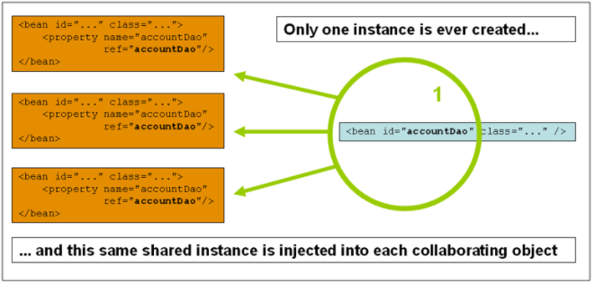
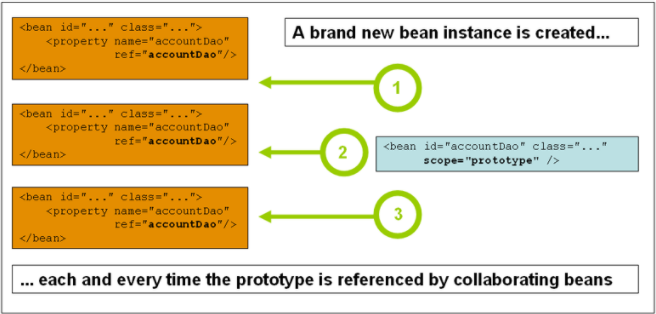

### 1. Bean的类型

**普通 Bean 、工厂 Bean**

#### 1.1 普通Bean

```java
@Component
public class Child {

}
```

或者这样：

```java
@Bean
public Child child() {
    return new Child();
}
```

亦或者这样：

```xml
<bean class="com.linkedbear.spring.bean.a_type.bean.Child"/>
```

#### 1.2 FactoryBean

可以借助==FactoryBean==来使用工厂方法创建对象。

##### 1.2.1 FactoryBean是什么

==FactoryBean== 本身是一个接口，它本身就是一个**创建对象的工厂**。如果 Bean 实现了 `FactoryBean` 接口，则它本身将不再是一个普通的 Bean ，不会在实际的业务逻辑中起作用，而是由创建的对象来起作用。

`FactoryBean` 接口有三个方法：

```java
public interface FactoryBean<T> {
    // 返回创建的对象
    @Nullable
    T getObject() throws Exception;

    // 返回创建的对象的类型（即泛型类型）
    @Nullable
    Class<?> getObjectType();

    // 创建的对象是单实例Bean还是原型Bean，默认单实例
    default boolean isSingleton() {
        return true;
    }
}
```

##### 1.2.2 FactoryBean的使用

==FactoryBean== **创建的 Bean 是直接放在 IOC 容器中**了。

==FactoryBean== **本身的加载是伴随 IOC 容器的初始化时机一起的**。

==FactoryBean==** 生产 Bean 的机制是延迟生产**

##### 1.2.3 BeanFactory与FactoryBean的区别

==BeanFactory== ：实现 IOC 的最底层容器（从类的继承结构上看，它是最顶级的接口，也就是最顶层的容器实现；从类的组合结构上看，它则是最深层次的容器，`ApplicationContext` 在最底层组合了 `BeanFactory` ）

==FactoryBean== ：创建对象的工厂 Bean ，可以使用它来直接创建一些初始化流程比较复杂的对象

### 2. Bean的作用域

#### 2.1 SpringFramework中内置的作用域

SpringFramework 中内置了 6 种作用域（5.x 版本）：

| 作用域类型  | 概述                                         |
| ----------- | -------------------------------------------- |
| singleton   | 一个 IOC 容器中只有一个【默认值】            |
| prototype   | 每次获取创建一个                             |
| request     | 一次请求创建一个（仅Web应用可用）            |
| session     | 一个会话创建一个（仅Web应用可用）            |
| application | 一个 Web 应用创建一个（仅Web应用可用）       |
| websocket   | 一个 WebSocket 会话创建一个（仅Web应用可用） |

#### 2.2 singleton：单实例Bean



默认所有的 Bean 都是单实例的，即：**一个 IOC 容器中只有一个**。

```java
public class Child {
    
    private Toy toy;

    public void setToy(Toy toy) {
        this.toy = toy;
}

    // Toy 中标注@Component注解
@Component
public class Toy {
    
}
```

```java
@Configuration
@ComponentScan("com.linkedbear.spring.bean.b_scope.bean")
public class BeanScopeConfiguration {
    
    @Bean
    public Child child1(Toy toy) {
        Child child = new Child();
        child.setToy(toy);
        return child;
    }
    
    @Bean
    public Child child2(Toy toy) {
        Child child = new Child();
        child.setToy(toy);
        return child;
    }
    
}
```

```java
public class BeanScopeAnnoApplication {
    
    public static void main(String[] args) throws Exception {
        ApplicationContext ctx = new AnnotationConfigApplicationContext(BeanScopeConfiguration.class);
        ctx.getBeansOfType(Child.class).forEach((name, child) -> {
            System.out.println(name + " : " + child);
        });
        // child1 : Child{toy=com.linkedbear.spring.bean.b_scope.bean.Toy@971d0d8}
        // child2 : Child{toy=com.linkedbear.spring.bean.b_scope.bean.Toy@971d0d8}
    }
    
}
```

#### 2.3 prototype：原型Bean



图中的 3 个 ==accountDao==是 3 个不同的对象，由此可以体现出原型 Bean 的意思

```java
@Component
@Scope("prototype")
public class Toy {
    
}
```

```
child1 : Child{toy=com.linkedbear.spring.bean.b_scope.bean.Toy@18a70f16}
child2 : Child{toy=com.linkedbear.spring.bean.b_scope.bean.Toy@62e136d3}
```

#### 2.4 Web应用的作用域们

- request ：请求Bean，每次客户端向 Web 应用服务器发起一次请求，Web 服务器接收到请求后，由 SpringFramework 生成一个 Bean ，直到请求结束
- session ：会话Bean，每个客户端在与 Web 应用服务器发起会话后，SpringFramework 会为之生成一个 Bean ，直到会话过期
- application ：应用Bean，每个 Web 应用在启动时，SpringFramework 会生成一个 Bean ，直到应用停止（有的也叫 global-session ）
- websocket ：WebSocket Bean ，每个客户端在与 Web 应用服务器建立 WebSocket 长连接时，SpringFramework 会为之生成一个 Bean ，直到断开连接